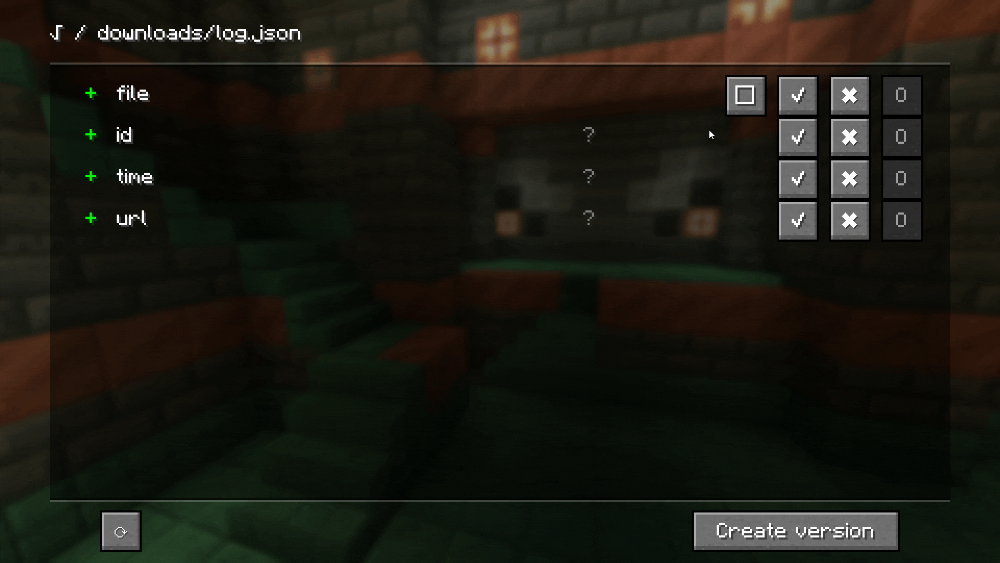
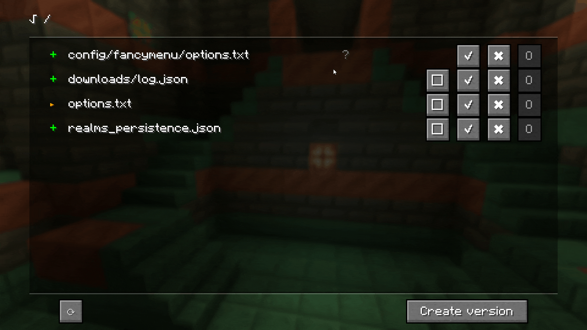

# SBCOU Introduction Documentation

This document serves as an initial guide to help understand SBCOU - both how to use it and how it works under the hood. While a more comprehensive documentation is in development, this introduction aims to provide early users with essential information about the mod. It may and will be incomplete and will be improved over time.

You'll find a mix of content here - from general concepts explained in a beginner-friendly way to more specific technical details that may be useful for power users.

## Core Concepts

### Game Directory and Modpack

A game directory (commonly known as the `.minecraft` folder) is a structured directory from which a Minecraft game instance runs. It contains all the necessary files and configurations for running the game.

A modpack is a downloadable game directory that comes with pre-configured content, including:
- Mod files
- Configuration files
- Resource packs
- Default settings

### Configuration and Options

The terms "configuration" and "options" refer to structured data stored in various files. In the context of SBCOU, these terms can have different specific meanings:

1. **SBCOU Mod Configuration**
   - The core configuration files managed by SBCOU
   - Also known as "SBCOU files"

2. **Individual Configuration Files**
   - Specific configuration files for mods or game settings

3. **Game Directory Configuration**
   - The complete set of configuration files across the game directory

### Versions

In the context SBCOU, there are two distinct types of versions:

1. **Configuration Version** (commonly referred to as "Version")
   - A set of changes that can be applied to configurations within a game directory
   - SBCOU tracks which versions have been applied
   - On game launch, SBCOU automatically applies any pending (unapplied) versions
   - This ensures configurations stay up-to-date with intended changes

2. **Modpack Version**
   - Represents an update to the modpack itself
   - Can introduce new Configuration Versions
   - When a user updates their game directory with the new version of the modpack:
     - New Configuration Versions are added to SBCOU's tracking system
     - These versions will be applied automatically on the next game launch

For simplicity, throughout this documentation:
- "Version" refers to Configuration Version unless explicitly stated otherwise
- "Update" refers to applying a Configuration Version, while "Modpack Update" specifically refers to updating to a new Modpack Version

## SBCOU and the configuuration versioning problem

### State of the Art

SBCOU is inspired by existing mods that modpack makers use to provide default options to their users. Let's examine the current approaches and their limitations:

#### Traditional Method
Without specialized mods, modpack makers must:
- Place configuration files directly in the game directory
- Overwrite all files during modpack updates
- This ensures up-to-date configurations but erases user customizations like:
  - Custom controls
  - Visual preferences
  - Performance settings

#### Default Options Mods
Current solutions like YOSBR work as follows:
- Modpack includes a mirror game directory with default configurations
- On game launch, the mod checks each configuration file
- If a file doesn't exist in the user's game directory, it's copied from the mirror
- This preserves user customizations while providing defaults for new files

#### Current Limitations
However, these solutions have significant drawbacks:

1. **All-or-Nothing Updates**
   - To force change a single option, the entire file must be overwritten
   - No way to selectively update specific options

2. **One-Time Application**
   - New options added to existing default configuration files only affect new users
   - Existing users miss updates because their configuration files already exist in the game directory
   - No mechanism to merge new defaults with existing user configurations

### SBCOU Solution

While the exact process will be detailed in later sections, SBCOU addresses these limitations through several key innovations:

1. **Granular Option Management**
   - Treats each configuration option as an individual entity
   - Supports most common file formats (JSON, Properties, etc.)
   - Can modify specific options without touching entire files

2. **Advanced Versioning System**
   - Moves beyond the simple mirror directory approach
   - Implements a version system independent from Modpack versions
   - Tracks and manages changes systematically
   - Each Configuration Version contains a set of changes that can:
     - Update default options for new users
     - Force-update options for existing users when specified by the Modpack maker that are applied only one time
     - Delete outdated options or files

## Guide for Modpack Makers

SBCOU consists of two separate mods:
1. **Base Mod**: Performs the configuration changes
2. **Dev GUI Mod**: Provides a graphical interface for creating configuration versions (for modpack developers only)

### Setup

As a modpack maker:
1. Add both mods to your development environment's mod directory
2. Launch the game to verify the installation:
   - Look for a button in the top-left corner of the main menu
   - This button opens the SBCOU version composition screen
3. Check that `.minecraft/config/sbcou` was created with SBCOU files inside

### SBCOU Version Composition Screen

This screen displays all options detected as modified since your last version. For first-time users, it shows all options in your configuration.

#### Navigation
- Initially shows top-level configuration (list of detected files)
- Use square buttons to open files and handle options individually
- Navigate between levels using the interactive path at top-left

#### Change Indicators
The colored signs in the left column indicate the nature of changes:

#### Available Actions

##### Include Changes
Two options for including changes in versions:

1. **Override with change**
   - Includes the change in the version
   - Forces overwrite when version is applied

2. **Set change to default**
   - Includes the change in the version
   - Only applies if option doesn't exist

##### Ignore Options
Three levels of ignoring changes:

1. **Ignore for this version**
   - Temporarily hide changes not ready for inclusion
   - Changes reappear after version creation for next version composition

2. **Ignore this change**
   - Ignores the specific change value
   - Remains ignored until option value changes again

3. **Permanently ignore this option**
   - Completely ignores the option
   - Useful for development-only configurations

#### Monitoring Changes
Track the status of changes directly on screen:

